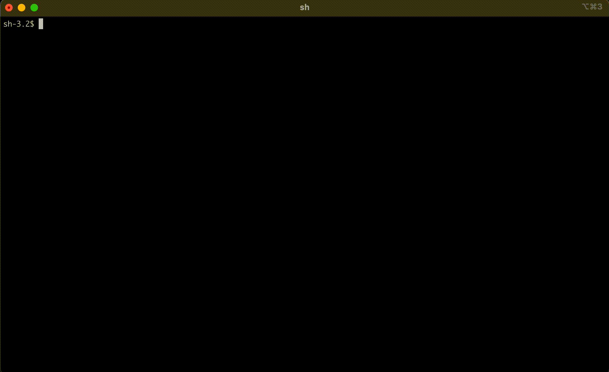

# npm-secure-installer

A secure global installer for NPM only whitelisting packages which uses npm-shrinkwrap to lock down dependencies and avoid supply-chain attacks.

This tool will help you avoid issues of dependency-like attacks when installing global dependency (e.g. CLI tool).

This was inspired from the recent "colors" fiasco.

### Usage:
    npm-secure-installer [PACKAGE-NAME]

